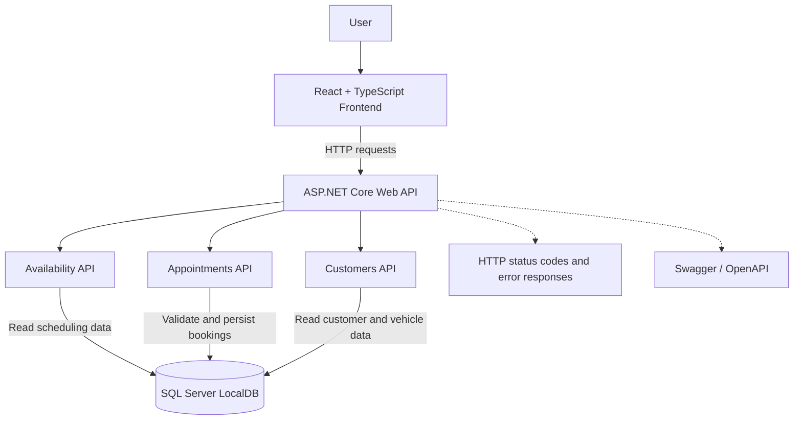

# Keyloop Service Scheduler — System Design Document

## 1. Overview

The Keyloop Service Scheduler is a web application that allows customers or service-centre staff to schedule vehicle service appointments, check resource availability, view existing appointments, and cancel bookings.

The solution uses a React and TypeScript frontend, an ASP.NET Core Web API backend, and SQL Server for persistent storage. The backend owns booking validation and scheduling-conflict checks; the frontend presents the workflow and displays API results.

## 2. Architecture Diagram

The API performs booking validation and conflict checks before persisting a booking. Appointment creation uses a database transaction in the current implementation. The diagram represents logical responsibilities, not separate deployed services: the controllers are part of the ASP.NET Core API application.

## 3. Component Responsibilities

### React Frontend

- Provides the dashboard, booking form, and appointments page.
- Loads dealership, service, customer, and vehicle information.
- Requests available technicians and service bays.
- Submits bookings and displays confirmation details.
- Allows users to view and cancel appointments.

### ASP.NET Core Web API

- Exposes REST endpoints for the frontend.
- Validates booking requests.
- Checks technician skills, service bays, and appointment overlaps.
- Calculates service end times from the selected service duration.
- Returns appointment details and handles cancellation.

### Availability API

- Finds technicians qualified for the requested service.
- Checks technician and service-bay availability.
- Excludes cancelled appointments from scheduling conflicts.
- Returns available technician and service-bay combinations.

### Customers API

- Provides customer information.
- Returns vehicles associated with a selected customer.

### SQL Server Database

- Persists dealerships, services, customers, vehicles, technicians, service bays, and appointments.
- Maintains entity relationships, indexes, and database constraints.
- Uses Entity Framework Core for database access.

### Observability and Diagnostics

Current diagnostic and verification capabilities include:

- HTTP status codes and API error responses to communicate request failures.
- Swagger UI for API exploration and manual verification.
- Automated tests for selected validation and booking scenarios.

ASP.NET Core logging is available as a framework capability, but production-ready centralized logging, metrics, tracing, dashboards, and alerting should be considered planned enhancements unless separately configured and verified in the application.

## 4. Data Flow

### Booking an Appointment

1. The user selects a dealership and service.
2. The user selects a service date and start time.
3. The frontend requests availability from the backend.
4. The backend checks qualified technicians, available service bays, and existing appointments.
5. The frontend displays available combinations.
6. The user selects a customer, vehicle, technician, and service bay.
7. The frontend submits the booking request.
8. The backend validates the request, including customer and vehicle association, service, dealership, technician skills, and service bay.
9. The backend checks for overlapping non-cancelled appointments for the selected technician and service bay.
10. The backend saves the confirmed appointment inside a database transaction.
11. The frontend displays the booking confirmation.

### Viewing Appointments

1. The user opens the Appointments page.
2. The frontend requests appointment data from the API.
3. The backend retrieves appointment information from SQL Server.
4. The frontend displays customer, vehicle, service, technician, service-bay, time, and status details.

### Cancelling an Appointment

1. The user selects Cancel Appointment.
2. The frontend asks for confirmation.
3. The frontend sends a cancellation request to the API.
4. The backend checks that the appointment exists and is not already cancelled.
5. The backend updates the appointment status to `Cancelled`.
6. The frontend reloads the appointment list to show the updated status.

Cancelled appointments are excluded from the booking-conflict checks, allowing the resources to be booked again for that time.

## 5. Technology Choices

| Technology | Purpose and justification |
|---|---|
| React | Component-based frontend and interactive user experience. |
| TypeScript | Compile-time type checking and maintainable frontend code. |
| Vite | Frontend development server and build tooling. |
| ASP.NET Core Web API | RESTful backend endpoints and request validation. |
| C# | Strongly typed backend business logic. |
| Entity Framework Core | Database access and migrations. |
| SQL Server LocalDB | Persistent relational storage for local development and demonstration. |
| Swagger / OpenAPI | API documentation and manual testing. |
| xUnit | Automated testing of controller behavior and selected business rules. |
| EF Core InMemory | Isolated tests for selected controller validation paths; it does not provide real relational transaction behavior. |
| SQLite in-memory | Relational integration tests for booking behavior and conflict checks. |
| Git and GitHub | Version control and source-code collaboration. |

## 6. Reliability, Scalability, and Maintainability

### Reliability

- Validate booking data on the backend.
- Use a database transaction during booking creation.
- Check technician and service-bay conflicts before confirming an appointment.
- Prevent cancellation of appointments that are already cancelled.
- Use automated tests to check selected expected behaviors.

The current integration tests exercise the controller with SQLite in-memory. They do not by themselves prove production SQL Server concurrency behavior under simultaneous requests; that should be verified with additional integration or load tests against a suitable SQL Server test environment.

### Scalability

- Keep frontend, API, and database responsibilities separate.
- Use stateless API request handling where practical.
- For production, deploy the API and frontend independently and use a managed SQL Server service.
- Consider database indexing and query optimization as appointment volume grows.

### Maintainability

- Organize API endpoints, entities, data access, and frontend components into separate files.
- Use DTOs for API request and response contracts.
- Use EF Core migrations to manage schema changes.
- Maintain automated tests for important business rules.

### Observability

Current verification includes API response status codes, Swagger-based manual checks, and automated test execution. The following are proposed production improvements rather than claims about existing configuration:

- Structured application logs for errors and important business events.
- API latency and failure-rate metrics.
- Request correlation IDs and distributed tracing.
- Dashboards and alerts for API availability, booking failures, and database connectivity.

## 7. Security Considerations

- Validate all booking requests on the server.
- Use Entity Framework Core for database access.
- Keep connection strings and credentials out of source control in production.
- Use HTTPS and an appropriate authentication and authorization mechanism before exposing the application to real users.
- Apply least-privilege database permissions in production.

Authentication and authorization should be treated as future work unless implemented and verified in the current application.

## 8. GenAI Design and Collaboration

### Design Phase

GenAI was used as an engineering assistant to help structure the system design, explore implementation approaches, explain technical concepts, and organize the assessment work into manageable tasks. The design was guided by the chosen scenario, the React and ASP.NET Core stack, the relational data model, and the booking requirements.

### Implementation Phase

AI assistance supported incremental work on the frontend workflow, API implementation, database integration, automated tests, and project documentation. Suggestions were considered in the context of the existing code and requirements rather than accepted automatically.

### Verification and Refinement

The application was built and run locally, API behavior was inspected using Swagger, frontend workflows were checked in the browser, and the automated test suite was executed.

During testing, EF Core InMemory did not support the transaction behavior used by the booking controller. The test strategy was adjusted: InMemory was retained for selected validation tests, while SQLite in-memory was used for relational booking integration tests. A reported vulnerability in a transitive SQLite dependency was also investigated; the SQLite provider was updated and the dependency vulnerability check was rerun.

These examples show how AI suggestions and implementation changes were checked against compiler output, test results, and dependency diagnostics. The developer remained responsible for reviewing the changes and the final design decisions.

For the final submission, include representative prompts and any relevant before/after examples as evidence of the AI collaboration process. Only describe prompts and verification steps that actually occurred.

## 9. Test Coverage

The current automated suite contains 13 tests, according to the latest reported test run. Coverage includes:

- Basic date/time behavior.
- Handling of missing appointments.
- Rejection of past appointment start times.
- Rejection of an unknown customer.
- Successful appointment creation.
- Technician and service-bay conflict checks.
- Cancellation of confirmed appointments.
- Rejection of repeated cancellation.
- Allowing a new booking when a previous appointment is cancelled.

The tests use xUnit, EF Core InMemory for selected controller tests, and SQLite in-memory for relational booking tests. Test results should be rerun and confirmed from the final submitted commit. These tests cover selected scenarios, not every possible input, race condition, or production database behavior.

## 10. Current Scope and Future Enhancements

### Implemented scope

- Service availability checks.
- Appointment creation and persistence.
- Appointment listing and retrieval.
- Appointment cancellation.
- Customer and vehicle selection.
- Technician and service-bay conflict checks.
- API documentation through Swagger.
- Automated tests for selected booking and cancellation scenarios.

### Potential future enhancements

- Authentication and role-based authorization.
- Automated reminders and notifications.
- Production deployment with managed database hosting.
- Centralized logs, metrics, tracing, dashboards, and alerting.
- More comprehensive automated tests, including concurrency tests against SQL Server.
- Improved appointment search and filtering.
