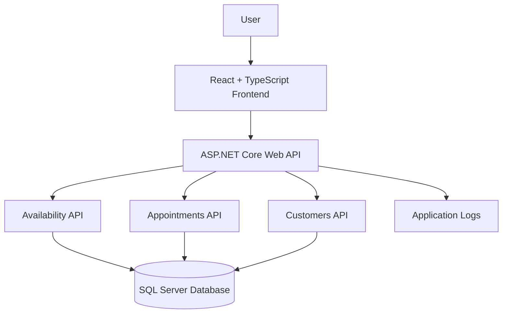

# Keyloop Service Scheduler — System Design Document

## 1. Overview

The Keyloop Service Scheduler is a web application that allows customers or service-centre staff to schedule vehicle service appointments, check resource availability, view existing appointments, and cancel bookings.

The solution uses a React and TypeScript frontend, an ASP.NET Core Web API backend, and SQL Server for persistent storage.

## 2. Architecture Diagram

## 3. Component Responsibilities

### React Frontend
- Provides the dashboard, booking form, and appointments page.
- Loads dealership, service, customer, and vehicle information.
- Requests available technicians and service bays.
- Submits bookings and displays confirmation details.
- Allows users to view and cancel appointments.

### ASP.NET Core Web API
- Exposes REST endpoints for the frontend.
- Validates booking requests.
- Checks technician skills, service bays, and appointment overlaps.
- Calculates service end times from the selected service duration.
- Returns appointment details and handles cancellation.

### Availability API
- Finds technicians qualified for the requested service.
- Checks technician and service-bay availability.
- Excludes cancelled appointments from scheduling conflicts.
- Returns available technician and service-bay combinations.

### Customers API
- Provides customer information.
- Returns vehicles associated with a selected customer.

### SQL Server Database
- Persists dealerships, services, customers, vehicles, technicians, service bays, and appointments.
- Maintains entity relationships and database constraints.
- Uses Entity Framework Core for database access.

### Observability
- ASP.NET Core logging can be used to record application events and failures.
- HTTP status codes and API error responses help diagnose request failures.
- Swagger UI supports API exploration and manual verification.
- Automated tests help detect regressions.

## 4. Data Flow

### Booking an Appointment

1. The user selects a dealership and service.
2. The user selects a service date and start time.
3. The frontend requests availability from the backend.
4. The backend checks qualified technicians, available service bays, and existing appointments.
5. The frontend displays available combinations.
6. The user selects a customer, vehicle, technician, and service bay.
7. The frontend submits the booking request.
8. The backend validates the request and checks for scheduling conflicts.
9. The backend saves the confirmed appointment in SQL Server.
10. The frontend displays the booking confirmation.

### Viewing Appointments

1. The user opens the Appointments page.
2. The frontend requests appointment data from the API.
3. The backend retrieves appointment information from SQL Server.
4. The frontend displays customer, vehicle, service, technician, service-bay, time, and status details.

### Cancelling an Appointment

1. The user selects Cancel Appointment.
2. The frontend asks for confirmation.
3. The frontend sends a cancellation request to the API.
4. The backend updates the appointment status to Cancelled.
5. The frontend reloads the appointment list to show the updated status.

## 5. Technology Choices

| Technology | Purpose and justification |
|---|---|
| React | Component-based frontend and interactive user experience. |
| TypeScript | Compile-time type checking and maintainable frontend code. |
| Vite | Frontend development server and build tooling. |
| ASP.NET Core Web API | RESTful backend endpoints and request validation. |
| C# | Strongly typed backend business logic. |
| Entity Framework Core | Database access and migrations. |
| SQL Server LocalDB | Persistent relational storage for local development and demonstration. |
| Swagger / OpenAPI | API documentation and manual testing. |
| xUnit | Automated testing of core business logic. |
| Git and GitHub | Version control and source-code collaboration. |

## 6. Reliability, Scalability, and Maintainability

### Reliability
- Validate booking data on the backend.
- Use a database transaction during booking creation.
- Check technician and service-bay conflicts before confirming an appointment.
- Prevent cancellation of appointments that are already cancelled.

### Scalability
- Keep frontend, API, and database responsibilities separate.
- Use stateless API request handling where practical.
- For production, deploy the API and frontend independently and use a managed SQL Server service.
- Consider database indexing and query optimization as appointment volume grows.

### Maintainability
- Organize API endpoints, entities, data access, and frontend components into separate files.
- Use DTOs for API request and response contracts.
- Use EF Core migrations to manage schema changes.
- Maintain automated tests for important business rules.

### Observability
- Use structured application logs for errors and important business events.
- Record API failures and latency.
- Consider request correlation IDs and distributed tracing for a deployed system.
- Consider metrics and alerts for API availability, booking failures, and database connectivity.

The production monitoring capabilities described above are proposed improvements unless explicitly implemented in the current codebase.

## 7. Security Considerations

- Validate all booking requests on the server.
- Use parameterized database access through Entity Framework Core.
- Keep connection strings and credentials out of source control in production.
- Use HTTPS and an appropriate authentication and authorization mechanism before exposing the application to real users.
- Apply least-privilege database permissions in production.

Authentication and authorization should be treated as future work unless implemented in the current application.

## 8. GenAI Assistance During Design

GenAI was used as an engineering assistant to help structure the system design, explore architecture options, explain implementation approaches, and improve documentation.

The development process involved:
- Providing the chosen scenario and technology constraints.
- Breaking implementation work into manageable tasks.
- Reviewing generated suggestions against the existing code and API contracts.
- Running the application and inspecting API responses.
- Running automated tests and correcting issues discovered during verification.
- Retaining responsibility for the final design and implementation decisions.

AI-generated recommendations were treated as suggestions rather than automatically accepted as correct. The final submission should describe the actual prompts, debugging steps, and verification work performed during development.

## 9. Current Scope and Future Enhancements

### Implemented scope
- Service availability checks.
- Appointment creation and persistence.
- Appointment listing.
- Appointment cancellation.
- Customer and vehicle selection.
- Technician and service-bay conflict checks.
- API documentation through Swagger.

### Potential future enhancements
- Authentication and role-based authorization.
- Automated reminders and notifications.
- Production deployment with managed database hosting.
- Centralized logs, metrics, tracing, and alerting.
- More comprehensive automated tests.
- Improved appointment search and filtering.
